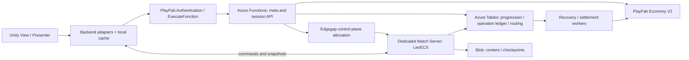

# TankDraft: PlayFab, Azure, Edgegap и серверная мета
Уточнение 2026-09-14: Fusion Dedicated выбран вместо Edgegap для следующих тестов. Azure/Edgegap/GSDK SDK-пробы удалены из активного проекта; PlayFab остаётся. См. [Fusion_Dedicated_Migration.md](Fusion_Dedicated_Migration.md) и PlayFab_Player_Data_Design.md. Ниже — исходный анализ, не актуальный перечень SDK.
Status: temporary R1 RemoteHost verified locally without Azure; isolated Azure adapters retained for future durable backend; cloud and release durability pending
Last reviewed: 2026-09-14

Актуальное решение владельца 14.09: [PlayFab_Player_Data_Design.md](PlayFab_Player_Data_Design.md) заменяет нижеописанное обязательное размещение custom progression в Azure Tables. Профиль — Entity Objects; экономика — Economy V2; конфиги — TitleData. Azure остаётся отключённым. Старые схемы Azure сохраняются как исторический вариант, не как требование первого meta slice. Облачный бой уже проверен; текущая приёмка — PC_Remote_Stability.md.

Локальный Windows GSDK lifecycle теперь проверен отдельно — [Gsdk_Local_Lifecycle.md](Gsdk_Local_Lifecycle.md). Это ограниченный server probe с LMA, не production host, login или облачный запуск.

## Решение и пределы этого этапа

Обязательны безопасность и отсутствие платежей на первых этапах. Порядок задаёт [Functional_Release_Plan.md](Functional_Release_Plan.md); текущая реализация — [Edgegap_Integration.md](Edgegap_Integration.md). S1/S2 runtime и S3 SQLite recovery/outbox проверены локально. PlayFab session verifier, Azure Tables/Blob write adapters и Edgegap REST adapter добавлены отдельно от домена. Их проверки с подменой провайдеров не доказывают production login, cloud recovery или выдачу наград. GSDK lifecycle проверен в отдельной MPS-пробе, не используется Edgegap.

Последнее поручение владельца заменяет первоначальный MPS hosting на тестовый Edgegap Free Tier. Для временного R1 Azure исключён из active deployment graph: PlayFab identity используется для account, Edgegap — для bounded authoritative queue/matches; Azure adapters остаются изолированными для будущих сохранений, economy и ledger. Никакие Azure resources или live mutations этим решением не разрешены. Самостоятельное включение платных услуг недопустимо.

Временный no-Azure prototype не обещает recovery: disconnect не останавливает server match, но потеря Edgegap container/instance voids любой незавершённый match без рейтинга или награды. `TankDraft.RemoteHost` локально реализован и проверен; cloud deployment и remote PvP не приняты. Полная durability требует внешнего идемпотентного result commit и будет принята отдельно. [Edgegap_NoAzure_Prototype.md](Edgegap_NoAzure_Prototype.md) задаёт границы и evidence.

Временный R1 stack: **Unity client + отдельный C# Match Server в Edgegap container + PlayFab identity**. Клиентский транспорт — существующая WSS boundary. Azure Functions, PlayFab Economy V2 и Azure Table/Blob Storage остаются будущим durable/meta stack и не входят в active deployment graph. Ни Mirror, ни PUN, ни Unity Dedicated Server не требуются pure .NET/LeoECS ядру. Queue Storage/Functions runtime подключаются только с будущим durable потребителем.

Это уточнение заменяет прежнюю рекомендацию обязательно начинать с VPS/PostgreSQL в [Networking_Stack_Comparison.md](Networking_Stack_Comparison.md). Контракты серверного матча из [Server_Authority_Architecture.md](Server_Authority_Architecture.md) сохраняются. Документы и исходники Chibi изучены read-only; работоспособность его облачного deployment и реальные транзакции в этом аудите не проверялись.

## Что действительно есть в Chibi Arena

Пути ниже относятся к `U:/UNITY_PROJECTS/chibi_arena`; указан код, а не подтверждение состояния live-сервиса.

| Область | Подтверждённое устройство | Вывод для TankDraft |
|---|---|---|
| Backend runtime | `PlayFabAzure/BackEnd/BackEnd.csproj:3`: net10.0, Functions v4 isolated, Worker 2.52.0, HTTP extension 3.3.0, Worker.Sdk 2.0.7, Azure.Data.Tables 12.9.1, Newtonsoft.Json 13.0.3 | Переносим C# и isolated Functions; версии проверяем/закрепляем отдельно, не копируем csproj вслепую |
| Identity | `Assets/_Game/Scripts/Backend/PlayFabSessionService.cs:37`: LoginWithCustomID через deviceUniqueIdentifier; получаются session ticket и Entity token | Это гостевой вход, не готовое восстановление Google/Apple аккаунта; device ID не считать секретом или доказательством владельца |
| Gateway | `PlayFabAzure/BackEnd/Functions/HandshakeFunction.cs:43`, `Session/SessionGatewayProcessor.cs:65`: identity из доверенного PlayFab context, сессия, подпись, request index и распределённый lock | Переносим доверенную identity и command boundary; HMAC с ключом у клиента не является anti-cheat и не заменяет бизнес-валидацию |
| Прогрессия | `PlayFabAzure/BackEnd/Progression/ProgressionStore.cs:155`: Azure Tables, условные insert/update/delete по ETag | Версионированное серверное состояние; не загружать клиентский JSON поверх экономики |
| Save lease | `PlayFabAzure/BackEnd/Save/SaveLeaseService.cs:7`: кооперативный lease; mutating commands не обязаны его проверять | Это UX второго устройства. Authority матча требует другого lease с fencing, проверяемого при записи |
| Магазин | `PlayFabAzure/BackEnd/Economy/PurchaseStoreItemService.cs:10`: Economy V2, серверная цена из main_store, limits, charge/grant | Клиент выбирает товар, сервер определяет цену и выдачу |
| Повторы | `Progression/ProgressionStore.cs:49`, `.agents/knowledge/backend/Backend_Map.md:83`: intent на command+txId, не один последний intent | Сохраняем результат операции до вызова провайдера; проверяем повтор по тому же payload |
| Конфиги | `.agents/project.md:93`: TitleData, локальные SO и кэш; backend тоже читает TitleData | Нужен единый экспорт, content version и фиксированный bundle на весь матч |
| Реальные IAP | `PurchaseStoreItemService.cs:10,324`, `Settings/FunctionsEnum.cs:12`: IAP-витрина и резерв команд; рабочего receipt redemption контура аудит не обнаружил | Unity IAP и Google/Apple server redemption реализуем как новый вертикальный сценарий |

Ограничения, которые не переносим:

- Free claim использует mark-before-grant; код описывает потерю выдачи при аварии без повторного запроса (`PurchaseStoreItemService.cs:37–47`). Сокращение окна гонки не равно атомарности.
- Комментарии про старый single intent row местами устарели; актуальные новые ключи — `intent:{command}:{txId}`. Legacy-строки читаются для совместимости.
- По `Backend_Map.md:204,223` отдельный durable Economy ledger/reconciliation отсутствует, intent sweep выполняется после 30 суток. Для денежных покупок это не готовая стратегия восстановления.
- Сессии/locks и ETag отдельной строки не превращают Azure Tables + PlayFab Economy в общую транзакцию.
- Новые TankDraft TitleId, store products, окружения и секреты должны быть отдельными. Chibi не изменяем и его пользовательские данные не мигрируем.

## Рекомендуемый стек

| Слой | Предложение | Статус |
|---|---|---|
| Клиент | Unity 6000.3.10f1, URP 2D, UGUI, VContainer/MessagePipe, UniTask, DOTween | Сохраняем установленную основу, без Odin |
| Правила | Match.Domain + Battle.Simulation/LeoECS Lite + contracts без UnityEngine | Уже отделены; отдельная серверная сборка ещё не проверена |
| Сервер боя | .NET 10 Linux x64 container на Edgegap; один последовательный владелец каждого матча | GSDK не требуется; не Azure Function для боевого цикла |
| Боевой транспорт | ASP.NET Core/Kestrel WSS, существующие DTO/codec за adapter | Проверить Android/iOS IL2CPP, размер snapshot, backpressure, TLS и задержку; Unity WebSocket adapter выбрать и закрепить после проверки |
| Unity-альтернатива | Mirror + Unity Dedicated Linux + GSDK | Потребует Unity host; сами игровые правила и Azure meta остаются теми же |
| Meta API | PlayFab ExecuteFunction → Azure Functions v4 isolated .NET 10 | Короткие команды, авторизация, sync, покупки, allocation/reconnect |
| Аккаунты | PlayFab Authentication + account linking и восстановление | Guest для раннего QA; platform credentials проверяются, переход сохраняет исходный account |
| Экономика | PlayFab Economy V2 catalog/store/inventory/currencies | Единственный владелец валют и экономических предметов |
| IAP | Unity IAP 5 adapter + PlayFab Apple/Google marketplace redemption | Кандидат, не установлен; версии и типы продуктов проверяются на sandbox |
| Custom progression | Azure Tables + ETag, один partition игрока для связанных записей | Mastery, arena/rating, claimed markers, operation ledger; экономические балансы только read projection |
| Match durability | Azure Tables + Blob Storage | Tables: owner epoch, журнал команд, results/outbox, routing; Blob: immutable content/checkpoints/replays |
| Асинхронная работа | Azure Storage Queues + Functions workers/recovery scanner | Повторная доставка ожидаема; таблицы являются истиной, очередь лишь будит обработчик |
| Secrets/observability | Server-only credentials, scoped access и bounded logs; Key Vault/Insights только после проверки тарифа | Edgegap organization token только в control plane; Azure managed identity в Edgegap автоматически не появляется |

Изменение прежнего предложения: PostgreSQL, отдельный Redis, Kubernetes, Nakama и дополнительный сетевой сервис Photon не нужны для первого Azure spike. Azure Tables не объявляется универсальной заменой SQL: нагрузка и транзакционные требования могут обосновать смену реализации хранилища позже.

Functions .NET 10 isolated/Flex Consumption — целевой Azure вариант с отдельной проверкой zero-charge режима. Длительное выделение Edgegap/recovery должно возвращать operation ID, а не держать PlayFab gateway HTTP-вызов до запуска контейнера. Прогресс таймеров боя не зависит от HTTP клиента. [Runtime](https://learn.microsoft.com/en-us/azure/azure-functions/dotnet-isolated-process-guide).

## Владельцы данных и поток UI

- View отправляет intent через Presenter/service и получает ViewModel; ни View, ни клиентский cache не назначают награды, цены и winner.
- Экономические состояния живут в Economy V2. Custom progression хранит только свои поля и ссылки/проекции, не второй независимо изменяемый кошелёк.
- Локальный JSON сохраняется для offline QA и пользовательских настроек. Production adapter асинхронный; текущий синхронный `IProfileRepository.Load/Save` не превращаем в скрытый сетевой вызов.
- Клиент не получает Azure Storage credentials, Function keys, title secret или права выдавать себе валюту. API policy закрывает обход серверных лимитов через прямые Economy writes/purchases.
- Identity берётся из проверенного контекста; client-supplied accountId не авторизует запрос. Для прямого match-server подключения нужен короткоживущий join ticket, привязанный к account/match/session/expiry; reconnect выдаёт новую сессию. HTTPS/WSS/TLS и Edgegap port mapping проверяются отдельно; обычный TCP port не обеспечивает TLS.
- Серверные callbacks результата требуют авторизации самого worker и актуального authorityEpoch. Клиентский ExecuteFunction не должен предоставлять игроку endpoint назначения победителя.

## Конфиги и каталоги

Сохраняем authored SO/catalog → exporter → versioned runtime data. Префабы и pools остаются подготовленными в Unity; .NET сервер загружает данные без UnityEngine и без визуальных assets.

Exporter строит валидируемый bundle с `contentVersion`, schema и hash. Клиент и сервер используют согласованную версию. Match фиксирует версию при создании и не подхватывает обновлённый баланс в середине боя. Старые bundles сохраняются на срок восстановления соответствующих матчей.

TitleData содержит указатели/небольшие настройки; большой bundle/checkpoint лежит в Blob. PlayFab Economy catalog/store владеет товарами/ценами; соответствие `unitId ↔ catalogItemId ↔ storeProductId` хранится в явной карте и проверяется при публикации. Механизм Chibi remote → cache → SO допустим для отображения и offline QA; при отсутствии нужной серверной версии ranked match не запускается с произвольным fallback.

## Матч, reconnect и отказ контейнера

Edgegap Free допускает один concurrent deployment. Для нескольких параллельных матчей нужен ограниченный multi-match worker; существующая локальная очередь — основа, не готовый production allocator. Число безопасных одновременных матчей определяется замером. Первый readiness container запускает только внутренний bounded smoke и не выдаёт игровых сессий.

1. Backend резервирует игрокам участие, создаёт `matchId`, фиксирует content/rosters и назначает слот в доступном Edgegap worker. Создание worker — отдельная durable операция; неоднозначный POST не повторяется до reconciliation. При нехватке людей применяется наш server bot fallback; бот тоже потребляет compute.
2. Worker получает ownership с `authorityEpoch`. В match partition атомарно фиксируются подтверждённые команды, очередность и изменения метаданных по ETag. `Accepted` возвращается после durable commit, `Received` не обещает принятия.
3. Все выборы и автошаги проходят один ordered command path. Клиенты отсутствуют — матч идёт дальше. Deadline, legal options и PRNG state принадлежат серверу; auto-choice записывается как обычное принятое решение.
4. Checkpoint содержит ECS/очередь событий/снаряды/зоны/RNG/tick/фазу/дедлайны/score. Blob сначала сохраняется неизменно; затем его manifest/hash публикуется условной записью Tables. Незавершённый blob не становится актуальным checkpoint.
5. Recovery scanner обнаруживает просроченного владельца, повышает epoch и восстанавливает checkpoint+журнал на доступном worker. В Free Tier replacement ограничен одним deployment; ожидание не отменяет сохранённый результат. Старый worker не может принять запись/settlement с устаревшим epoch. Повторное проигрывание не создаёт новые event/operation IDs.
6. Reconnect API возвращает текущий route и snapshot; если матч завершён, читает результат из Tables без нового боевого процесса. Два пропущенных раунда не требуют просмотра двух анимаций.
7. После durable результата и settlement intent освобождается слот матча. Получение награды не зависит от возвращения клиента или жизни контейнера.

Edgegap Free останавливает deployment по часовому лимиту. Заранее закрываем admission, завершаем/сохраняем начатые матчи; новый deployment не получает прежнюю память/диск автоматически. Readiness probe сам завершается ещё раньше, по конфигу до 30 минут. [Edgegap pricing](https://edgegap.com/resources/pricing).

Обычный client disconnect, падение worker и потеря durable storage — разные отказы. Checkpoint+replay должен восстановить принятые команды. Поведение времени во время аварии backend и компенсация невосстановимого матча остаются продуктовыми решениями из Server_Authority_Architecture; не вводим тайком technical draw, HP timeout или auto-surrender.

## Покупки и выдача наград

Магазин за игровую валюту: intent с `operationId`, товаром и количеством → серверная проверка требований/цены/лимита → фиксированный operation envelope → Economy V2 → запись результата → новая read model. Случайная награда выбирается один раз и сохраняется до внешней выдачи.

Реальные деньги обрабатывают Google Play/App Store, Unity IAP предоставляет клиентский store flow, PlayFab выполняет marketplace redemption и выдачу economic items. Azure координирует entitlement/progression и восстановление; PlayFab не заменяет магазин как платёжный провайдер.

IAP flow: store pending order → проверенный PlayFab redemption → подтверждённая выдача/восстановление результата → только затем store confirmation. Повторное открытие приложения, restore и потеря ответа должны приводить к той же покупке. Не выдаём второй комплект вручную после успешного Redeem. Для разных типов продуктов проверяем consume/acknowledge, already-redeemed, non-consumable restore, account linking, refunds/revocations и store notifications. Подписки, если появятся, требуют отдельного lifecycle.

В Economy V2 обычный IdempotencyId хранится **14 суток**; Apple/Google Redeem имеют собственную дедупликацию receipt/token. Это разные механизмы. [PlayFab idempotency](https://learn.microsoft.com/en-us/xbox/playfab/economy-monetization/economy-v2/tutorials/idempotent-transactions-and-retries), [Google](https://learn.microsoft.com/en-us/xbox/playfab/economy-monetization/economy-v2/marketplace/marketplace-redemption/google), [Apple](https://learn.microsoft.com/en-us/xbox/playfab/economy-monetization/economy-v2/marketplace/marketplace-redemption/apple), [Unity purchases](https://docs.unity.com/iap/purchases).

Для TankDraft предлагаем durable `OperationLedger`: `Pending → Applied/Rejected`, промежуточное `Unknown` при неоднозначном ответе провайдера. Запись содержит operation type, account, payload hash, pinned grants/price, provider transaction reference и результат. Pending обнаруживается worker-ом без клиента. Applied возвращает сохранённый ответ; другой payload с тем же ID отвергается.

Azure и Economy не образуют общую транзакцию: применяем outbox + retry/reconciliation. Не выдаём награду новым idempotency key после timeout. После истечения окна провайдера неоднозначная операция требует reconciliation по transaction history/receipt, иначе review без повторного начисления. Вечное хранение/retention денежных доказательств определяется отдельно; не копируем Chibi sweep 30 дней на все IAP.

Azure Tables batch атомарен только в одной таблице/partition, максимум 100 операций/4 MiB. Результат матча и outbox можно сохранить в match partition; отдельные проекции каждого игрока и Economy grants применяются идемпотентно после этого, не объявляются одной глобальной транзакцией. Внутри player partition reservation лимита и operation intent должны быть атомарными. [Table transactions](https://learn.microsoft.com/en-us/rest/api/storageservices/performing-entity-group-transactions).

## Бюджет испытаний и прежний MPS вариант

Текущий бесплатный compute — Edgegap Free; квоты подтверждены в аккаунте, [Edgegap_Integration.md](Edgegap_Integration.md). Это не делает Azure Storage/Functions бесплатными. При 100 одновременных PvP игроках нужно до 50 матчей, против ботов — до 100; вместимость worker пока неизвестна. Ниже сохранены справочные ограничения прежнего MPS варианта; они не разрешают его активацию.

- Подробная MPS документация указывает 750 Dasv4 core-hours/месяц отдельно North Europe и East US, 24 simultaneous cores на регион и ограниченный egress. Страница pricing называет часы VM-hours: до deployment сверить единицы и доступность квоты в аккаунте. Не объединять два региональных лимита в один европейский.
- Standby, startup, active и оставшиеся VM расходуют вычислительное время; после тестового окна дожидаемся завершения матчей и выводим standby в ноль. VM/core cap не является денежным hard cap.
- Pay-as-you-go не требует платной подписки Standard; дополнительные MPS compute/traffic/storage учитываются отдельно. Foundation Mode не включает MPS и не является нашим бесплатным hosting-планом.
- Azure Functions Flex on-demand имеет бесплатную квоту 250 000 executions и 100 000 GB-s/месяц на подписку. Это не бесплатные Storage/Key Vault/Application Insights и не гарантия бесплатного always-ready. Во время тестов без always-ready, с ограниченной concurrency и retention логов; расходы всё равно проверяются отдельно.
- Сначала локальные GSDK/Functions/Azurite тесты, затем отдельный development title и Azure environment. Проверить eligibility, billing account и region до запуска; live каталоги/реальные покупки не трогать.

[MPS billing](https://learn.microsoft.com/en-us/xbox/playfab/multiplayer/servers/billing-for-thunderhead), [PlayFab pricing](https://developer.microsoft.com/en-us/games/products/playfab/pricing/), [Foundation exclusions](https://learn.microsoft.com/en-us/xbox/playfab/get-started/mode-overview), [Functions pricing](https://azure.microsoft.com/en-us/pricing/details/functions/).

## Первоначальная декомпозиция (порядок заменён Functional Release Plan)

| Шаг | Конкретный результат | Что проверяем |
|---|---|---|
| 1. Local backend foundation | Backend/Meta.Functions, Match.Server, Contracts, тестовые adapters; отдельная сборка pure ядра; JSON QA остаётся | No Unity dependency в .NET ядре, экспорт контента, локальный GSDK lifecycle, две независимые клиентские сессии |
| 2. Identity + profile vertical | PlayFab login/link interfaces, ExecuteFunction, server profile read model, Azure Tables/Azurite | Чужой accountId, stale version, второй девайс, retry после потерянного ответа; cloud profile не загружается из JSON |
| 3. MPS development spike | Один регион, минимальный standby, allocation, authenticated connection, полный match без player-host | Оба клиента offline, несколько пропущенных драфтов, reconnect в бой/после результата, restart worker, stale epoch, content mismatch |
| 4. Settlement + shop | Durable result/outbox/ledger, Economy V2 sandbox currency/item | Crash до/после grant, повтор через другой session, спорный ответ, повтор pending без клиента, лимит товара при параллельных запросах |
| 5. Store IAP vertical | Один consumable + один non-consumable в Google/Apple sandbox, pending/restore/refund flow | Kill приложения между оплатой и выдачей, duplicate receipt, смена девайса/аккаунта, store acknowledgement |
| 6. Load and cost | 20/50/100 клиентов, число процессов/VM, CPU/RAM, трафик, latency, счёт | Отдельно PvP/bots/offline matches; нагрузка и аварии до расширения ресурса |

Шаги являются готовым планом, не отчётом о выполнении. Для первой проверки можно отложить весь магазин, но нельзя считать локальную mock-выдачу проверкой PlayFab Economy или sandbox IAP. Первый сквозной cloud acceptance должен показать login → match → сохранённый результат → идемпотентную награду → повторный вход.

## Исторический снимок первоначального аудита

TankDraft остаётся на PUN 2 prototype и локальном JsonProfileRepository. PlayFab/GSDK/Mirror/IAP не импортированы этим патчем. Unity MCP подтвердил правильный проект, Unity 6000.3.10f1, MainMenu, Edit Mode, clean scene, not compiling. Проверки этой задачи — статический аудит кода/документов и официальных источников; сетевые, нагрузочные и store sandbox тесты не запускались.

Осталось подтвердить spike-ом: pure .NET host + WSS vs Mirror/Unity, конкретные SDK pins и IL2CPP, TLS/server credentials, доступную MPS-квоту, latency Functions gateway и выбранного региона. Продуктовые вопросы: правила времени при аварии нашего backend и компенсации, окончательные выборные таймеры, account recovery UX и store product mapping. Ничего из этого не подменяется успешной установкой SDK.
