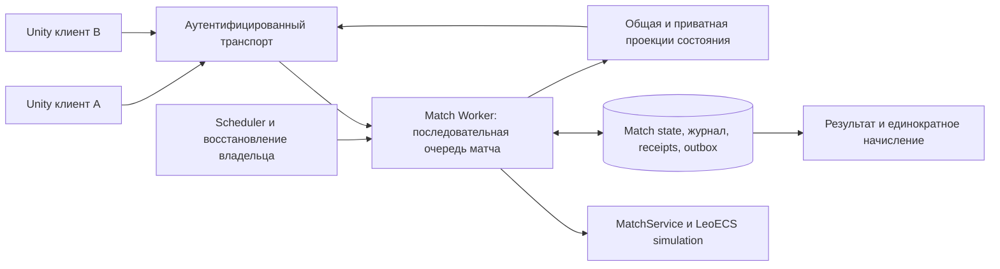
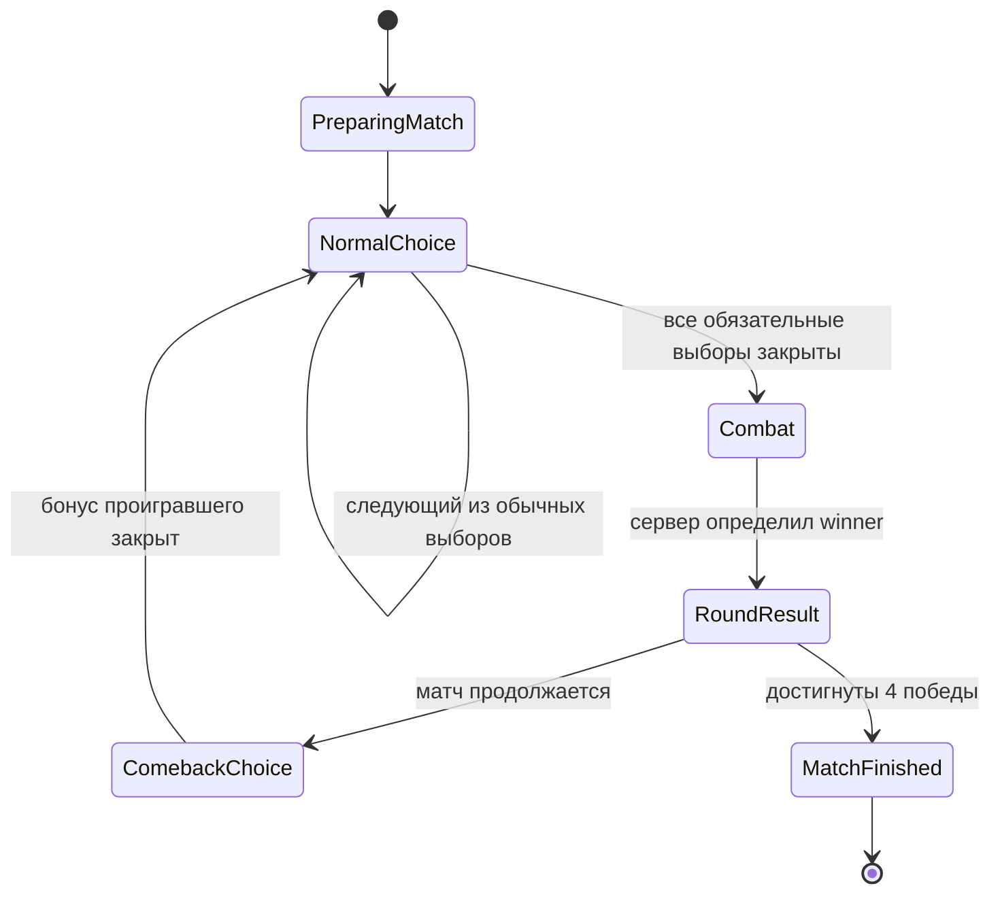

# Сервер матча: исследование и предлагаемая архитектура
Status: research and owner requirements accepted; S1/S2/S3 local runtime/recovery verified; distributed failover, client transport and cloud pending
Last reviewed: 2026-09-13

## Вывод для принятия решения

Актуальный статус реализации: S1/S2 runtime и S3 локальный SQLite recovery выполнены — [Server_Match_Runtime.md](Server_Match_Runtime.md), [Server_Match_Persistence.md](Server_Match_Persistence.md). Durable commit, replay активного боя и outbox проверены при сохранном локальном диске. Последующие требования distributed failover, внешнего settlement и release outage policy остаются целевыми. Порядок в [Backend_Implementation_Plan.md](Backend_Implementation_Plan.md): далее S4 клиент/протокол; cloud gate закрыт до подтверждения нулевых платежей.

TankDraft нужен доверенный сервер матча, работающий независимо от телефонов игроков и существования транспортной комнаты. Обычный PUN 2 сам такую серверную логику не предоставляет. Текущий сетевой прототип доказал работоспособность передачи команд и состояний, но его authority выполняется на клиенте игрока и не отвечает новым требованиям релиза.

Владелец 2026-09-13 выбрал попробовать PlayFab Multiplayer Servers для dedicated hosting, а PlayFab + Azure — для мета-сервисов. Рекомендуемая основа серверного кода: отдельный C# Match Server с нашим `MatchService`/LeoECS Lite и последовательной обработкой каждого матча. Прямой HTTPS/WebSocket transport остаётся кандидатом для spike; конкретные transport и версии SDK ещё не зафиксированы. Актуальное уточнение — [PlayFab_Azure_Stack.md](PlayFab_Azure_Stack.md). PUN не заменяется, SDK не меняются, live provisioning не создаётся этим документом.

Основной режим боя предлагается оставить пошаговым по simulation time на сервере, с потоком состояний клиентам. Предрасчёт всего боя не нужен для reconnect и усложнит будущие команды во время боя. Журнал и восстановление требуются в обоих вариантах.

Это проектное предложение, а не описание закрытой инфраструктуры Blizzard. Источники проверены 2026-09-13. Ни эта схема, ни выбор SDK не гарантируют отсутствие всех багов: ниже определены отказы, инварианты и проверки, по которым оценивается готовность.

## Принятые требования и границы

Явное уточнение владельца от 2026-09-13:

- Клиент отправляет решения; сервер проверяет их допустимость, изменяет матч и возвращает подтверждённое состояние.
- Время выбора и переходы фаз принадлежат серверу. Отсутствие одного или обоих клиентов не останавливает матч.
- На каждом пропущенном выборе сервер случайно выбирает допустимое усиление. Правило действует и при отсутствии несколько раундов подряд.
- Возвращение восстанавливает актуальный матч или его завершённый результат. Просмотр пропущенных анимаций не обязателен.

Сохраняются прежние решения: 4 выигранных раунда; камбэк перед обычными выборами; синхронные по смыслу боевые события; возможность будущих команд в бою; точное время гибели и единый случайный winner только при точном совпадении. Лимит времени **выбора** не вводит отклонённый ранее лимит боевой фазы или победу по оставшемуся HP.

Всё далее, что не отмечено как требование владельца или факт источника, — рекомендуемый контракт для обсуждения. Продолжительность выбора, досрочный переход после двух решений и поведение при аварии нашего backend ещё не утверждены. В этом патче меняется документация; сетевой runtime остаётся прототипом.

## Что действительно даёт Photon

| Механизм | Подтверждённая возможность | Следствие для TankDraft |
|---|---|---|
| PUN 2 | Клиентская реализация; произвольная authoritative game logic не исполняется обычным PUN за нас. PUN находится в maintenance/LTS. | Настройка AppId и `MasterClient` не превращают игрока в доверенный сервер. [Photon: protection](https://doc.photonengine.com/pun/current/gameplay/hackingprotection) |
| Host migration | Photon выбирает новый MasterClient, но не переносит всю внутреннюю память прежнего и не переадресует автоматически его недоставленные сообщения. | Это не восстановление ECS, RNG, решений и результатов. [Photon: host migration](https://doc.photonengine.com/pun/current/gameplay/hostmigration) |
| `ReconnectAndRejoin` | Быстрый путь зависит от существования комнаты, сохранённого actor, `PlayerTTL` и идентичности пользователя. | Полезен при кратком обрыве; долгий возврат и перезапуск приложения требуют собственного поиска матча по аккаунту. [Photon: disconnects](https://doc.photonengine.com/pun/current/troubleshooting/analyzing-disconnects) |
| `PlayerTTL` / `EmptyRoomTTL` | Сохраняют actor/комнату в предусмотренных пределах. | Срок хранения результата и работа матча должны быть независимыми от TTL. [Photon: FAQ](https://doc.photonengine.com/pun/current/troubleshooting/faq) |
| Cached events | Кэш помогает позднему входу; имеет ограничения, очистку и может задерживать live events. | Не накапливать весь матч в buffered RPC. Нужны отдельные snapshot и журнал. [Photon: event cache](https://doc.photonengine.com/pun/current/gameplay/cached-events) |
| Webhooks | Внешние уведомления и сохранение/загрузка room state. `PathEvent` зависит от forwarding; ошибка большинства hooks не отменяет нормальное выполнение операции. | Webhook уведомления не являются обязательным барьером валидации каждого игрового действия. [Photon: webhooks](https://doc.photonengine.com/pun/current/gameplay/web-extensions/webhooks) |
| Server Plugin | Перехват операций, фильтрация событий, свои серверные события и timers; доступен Enterprise Cloud или self-hosted Photon Server. | Можно реализовать authority, но надо написать его, проверить совместимость библиотек и организовать эксплуатацию. [Photon: plugins FAQ](https://doc.photonengine.com/server/v5/plugins/plugins-faq), [manual](https://doc.photonengine.com/server/v5/plugins/manual) |
| Custom Authentication | Позволяет проверять пользователя через внешний сервис; аккаунтную систему предоставляет разработчик. | Нельзя доверять выбранным клиентом `UserId`, роли, коллекции или месту в матче. [Photon: authentication](https://doc.photonengine.com/pun/current/connection-and-authentication/authentication/overview-auth) |

Plugin timers существуют, пока живёт соответствующий plugin/room. Сохранить комнату перед закрытием и оживить при следующем входе — недостаточно для требования «матч шёл всё время, даже без игроков». В PUN-варианте отдельно проектируется независимый scheduler/worker либо доказанный жизненный цикл серверной комнаты, переживающий отсутствие клиентов; аварийное восстановление всё равно требует durable state. Это вывод для нашего требования из [жизненного цикла plugin timers](https://doc.photonengine.com/server/v5/plugins/manual#timers).

`PhotonNetwork.Time` полезен для общей шкалы отображения, но не запускает игровое правило по дедлайну на сервере. Для собственного backend источником фазового времени будет его clock; Photon time, если оставляем транспорт, получает явное отображение в эту шкалу. Нельзя смешивать timestamps разных подключений/часов. [PhotonNetwork API](https://doc-api.photonengine.com/en/pun/current/class_photon_1_1_pun_1_1_photon_network.html)

При выборе plugin: проверять вход через `OnRaiseEvent`, защищённые свойства через `BeforeSetProperties`, завершать callback одним из предусмотренных результатов. `OnJoin`-снимок отправлять после фактического добавления actor. Gameplay ACK — собственное событие после commit. Не блокировать обработку комнаты запросом в БД; завершение I/O возвращать в последовательную очередь. Это применение [контрактов plugin callbacks](https://doc.photonengine.com/server/v5/plugins/manual) и [последовательного исполнения hooks](https://doc.photonengine.com/server/v5/plugins/plugins-faq) к нашему протоколу.

## Что берём у Hearthstone / Battlegrounds

Официальные материалы подтверждают таймеры ходов Battlegrounds и существование восстановления в идущую игру. Blizzard отдельно исправляла порядок отображения таблицы при reconnect и уведомлений перед combat. Это полезные примеры независимости игрового состояния и его показа. Исторические значения таймеров 2020–2021 годов не используются как актуальный баланс TankDraft. [21.2 patch](https://hearthstone.blizzard.com/en-us/news/23712592/21-2-patch-notes), [16.4 patch](https://hearthstone.blizzard.com/en-gb/blog/23312587/)

В найденных первичных материалах нет достаточного описания БД, серверного scheduler, формата checkpoint и точного момента предрасчёта всего боя Battlegrounds. Поэтому утверждать «Blizzard использует именно такую технологию» нельзя. Рандомный автовыбор нескольких пропущенных усилений — наше явное требование, а не установленное здесь правило Hearthstone.

Переносим продуктовый принцип: анимация показывает подтверждённые действия, состояние матча не определяется тем, досмотрел ли её клиент. Blizzard также публично описывает работу над редкими взаимодействиями таймингов: даже зрелая игра требует явных правил и регрессионных проверок. [Hearthstone Gameplay Engineer: mechanics update](https://news.blizzard.com/en-us/article/21037565/hearthstone-game-mechanics-update)

## Выбор размещения и транспорта

| Вариант | Серверная ответственность | Цена сложности и решение |
|---|---|---|
| PUN с authority у игрока | Клиенту приходится доверять; его отключение влияет на матч | Оставить как прототип, для требуемого релиза исключить. |
| PUN + Photon Server Plugin | Доверенная фильтрация и исполнение на Photon Server | Сохраняет PUN; нужны Enterprise/self-hosting, durable storage, восстановление и продвижение без игроков. Кандидат, если PUN обязателен. |
| Отдельный worker, подключённый к обычной Photon-комнате как служебный peer | Worker считает матч; обычный Photon relay не начинает проверять наши правила | Технический кандидат для spike, не утверждённый production путь: дополнительный участник, восстановление комнаты, проверяемая серверная идентичность, ограничения клиентских room operations. Одного `ActorNr`/room property «это сервер» недостаточно. |
| C# Match Server + HTTPS/WebSocket | Весь командный вход, время, симуляция и хранение контролируются нашим сервисом | Рекомендуемый кандидат для этой игры; требуется согласовать замену матчевого транспорта и самим обеспечить hosting, auth, reconnect, нагрузку. |
| Fusion 2 Dedicated Server | Доверенный выделенный simulation host | Альтернатива при потребности в более широком real-time SDK; не устраняет БД/settlement/recovery. Самостоятельная миграция SDK не выполняется. |

Служебный peer — архитектурное предположение на базе доступного C# Realtime SDK, **не готовая гарантия Photon**. Если его исследовать, серверные сообщения должны иметь проверяемое происхождение через доверенную сессию/подпись, а клиентские room properties не могут менять authority, состав и результат матча. Злоупотребление транспортом остаётся отдельной проблемой. [Realtime C# workflow](https://doc.photonengine.com/realtime/v5/connection-and-authentication/realtime-workflow-cs)

Fusion Server Mode требует отдельного размещения выделенного приложения; подписка Photon сама его не размещает. [Fusion dedicated hosting](https://doc.photonengine.com/fusion/v2/concepts-and-patterns/dedicated-server-overview)

На старте достаточно модульного серверного приложения и БД: один процесс может вести множество матчей. Не нужен Unity-процесс на каждый матч и не нужны отдельные микросервисы для каждого правила. Регистрация, подбор, матч и выдача результата имеют отдельные контракты, но могут работать в одном deployment. Проверить direct WebSocket на реальной нагрузке: упорядоченная доставка может задерживать свежие данные за потерянными/крупными пакетами; выбирать его по измерениям, не по обещанию отсутствия лагов.

Актуальные публичные тарифы, сравнение сетевых пакетов и бюджет стенда для 20–100 игроков разобраны в [Networking_Stack_Comparison.md](Networking_Stack_Comparison.md). Полная стоимость релиза ещё требует целевых CCU/регионов, длительности матча, измеренных CPU/RAM/трафика, требований доступности и предложения Photon Enterprise при выборе этого пути. Сравнивать полную стоимость Photon + worker/DB/egress/поддержка с direct server + DB/egress/поддержка; цена тестового VPS не является сметой массового релиза.

## Предлагаемая структура

Один логический writer на `matchId`. Бои разных матчей параллельны; два handlers одного матча не меняют его состояние одновременно. Наличие socket и статус присутствия не управляют жизнью worker. Бот подбора и timeout-автовыбор — разные политики: полноценный бот отправляет законные решения, а временное отсутствие человека запускает только согласованное правило автоподбора.

Authoring сохраняется: `ScriptableObject / каталоги → валидированный versioned data bundle → runtime data`. Сервер получает сериализованные игровые данные, стабильные content IDs и hash; ему не нужны Unity prefabs, материалы или `AssetDatabase`. Unity views берутся из уже подготовленных префабов. Сервер выбирает версию правил и разрешённую колоду из подтверждённого профиля; клиент не загружает серверу «свои правильные характеристики танка».

Каждый матч закрепляет `protocolVersion`, `rulesVersion`, `contentHash`, версию симуляции и RNG. Обновление балансных SO не меняет уже начатый матч. Старую серверную версию сохраняем для восстановления её активных матчей; deployment перестаёт принимать новые матчи перед остановкой старого worker.

## Фазы, дедлайны и случайный выбор

Логическая схема сохраняет найденный порядок драфта; длительности пока задаются только как будущие конфиги:

`Connected / Reconnecting / Offline` — отдельное состояние присутствия, а не дополнительная фаза матча. Для таймеров выбора нужны `phaseId`, `phaseRevision`, `startedAt`, `deadlineAt`, ожидаемые места игроков и уже принятые решения. `phaseId` уникален и включает номер раунда/шага; недостаточно сравнивать только название `Draft`.

Предложение: отдельный лимит на каждый выбор из трёх, одинаковый для обычного выбора обоих игроков; отдельный лимит бонусного выбора проигравшего. После двух подтверждённых обычных решений можно начать следующий шаг раньше. Это сохраняет последовательные выборы текущего flow; единый бюджет всей подготовки — альтернативное продуктовое решение, не автоматический перенос Battlegrounds. Неподключившийся игрок получает оставшееся время до того же дедлайна, а не новый персональный таймер.

Правила обработки времени:

1. Сервер сохраняет абсолютный дедлайн и использует монотонные часы внутри работающего процесса. Системные часы синхронизируются; их скачок не должен повторять уже выполненный переход.
2. Timer callback только будит обработчик. Истёкшие фазы проверяются также при входе команды и при восстановлении worker. Потерянный callback не оставляет матч навсегда в `Draft`.
3. Граница приёма — `receivedAt < deadlineAt` в доверенном последовательном входе владельца матча. В точном равенстве действует timeout. Клиентский timestamp не принимается как доказательство своевременного нажатия.
4. Доверенный ingress присваивает командной записи порядок и время после проверки сессии/формата. Команды, попавшие в этот вход до границы, обрабатываются перед закрывающим её timeout, даже если handler задержался. Нельзя сначала выполнить запоздалый timer, а потом отвергнуть уже стоявшую перед ним своевременную команду. В multi-gateway схеме нужна эквивалентная централизованная граница, а не сравнение несогласованных часов gateway.
5. Отправка клиентом до нуля без получения на сервере до границы не гарантирует принятия. UI показывает отправку как pending, затем ACK или текущий авторитетный выбор; при задержках не обещает «уже куплено». Клиентская анимация не продлевает deadline.
6. Истечение шага, автовыбор, изменение армии и переход фиксируются одной логической транзакцией. Уникальный ключ `(matchId, phaseId, seat, decisionSlot)` не позволяет одновременно применить ручной выбор и timeout.

Для timeout предлагается равномерный выбор среди **текущих допустимых предложенных вариантов**. Генерация оффера уже использовала свои веса: второе взвешивание случайного выбора не вводим без решения дизайна. RNG серверный, с независимыми потоками для офферов, автовыбора, боя и tie-break. Seed создаётся для нового матча, сохраняется; фиксированный QA seed не становится production правилом.

Сохраняем выбранный `offerId/cardId`, причину `DeadlineExpired` и версию политики. Повторный запрос или рестарт не перебрасывают выбор. Если вариант требует дополнительную цель, политика обязана случайно выбрать допустимую цель через тот же validator. Пустой набор допустимых вариантов — ошибка контента/правил с диагностикой, а не возможность создать произвольное усиление. Нужен контентный invariant, что обязательный выбор всегда разрешим.

Бонусный камбэк при отсутствии тоже выполняется. Несколько последовательных пропусков обрабатываются по порядку: следующий оффер генерируется уже с учётом предыдущего усиления. Не выбирать заранее все будущие карты из старой армии. Уже лежащие в запасе расходуемые приказы не тратятся автоматически только потому, что человек отключился; это отдельная, пока не согласованная политика. Опциональное действие в бою по умолчанию отсутствует, если команда не пришла.

После `RoundResult` переход запускается сервером по его времени; кнопка «Продолжить» может ускорять допустимый переход, но отсутствие её нажатия не блокирует матч. Медленные эффекты/низкий FPS догоняются или пропускаются до начала следующего интерактивного шага. Reconnect не должен давать больше времени или раньше раскрывать следующий оффер, чем обычное подключение.

## Бой: текущая симуляция или предрасчёт

| Модель | Восстановление | Ограничение |
|---|---|---|
| Полный серверный предрасчёт + показ журнала | Передать нужный момент записи или текущую фазу; результат уже известен серверу | Новые боевые решения меняют будущее, поэтому результат нельзя считать окончательным заранее. Нельзя раскрывать клиенту будущие события/исход до разрешённого момента. |
| Серверная симуляция по ходу времени | Передать текущее состояние и дальнейший поток, пропустив уже прошедшие эффекты | Нужны работающий scheduler, восстановление simulation state и контроль нагрузки. Рекомендуется для TankDraft. |

Часы независимы: simulation tick/sub-tick задаёт порядок попаданий; серверный phase clock задаёт окно решения; presentation clock клиента плавно показывает подтверждённое прошлое с буфером. Сервер не спрашивает клиента, закончилась ли анимация снаряда, чтобы назначить урон или победителя.

Порядок и единицу точности времени фиксируем в версии симуляции. Разница меньше одного 30 Hz tick не должна автоматически становиться ничьей: учитываются времена событий внутри tick с точностью как минимум до миллисекунд. Только **точное равенство в принятой модели времени** допускает согласованный random tie-break. Диагностический след отдельного tie-break можно передать обоим клиентам, но нельзя раскрывать общий secret seed будущих офферов и автовыборов.

Server replay нужен для восстановления и диагностики, но не означает обязательный клиентский lockstep. Для повторного расчёта закрепляем server build/runtime, порядок обхода, RNG, арифметику и входы; межплатформенная детерминированность Unity-клиентов не является предпосылкой серверной схемы.

Баланс должен завершать обычный бой быстро. Отдельный технический watchdog нужен против зависшего handler, бесконечного spawn и невалидных чисел; он фиксирует техническую неисправность и запускает восстановление/разбор. Он не назначает победу по HP и не превращается в скрытый игровой таймаут.

## Команды, идентичность и валидация

Предлагаемый envelope: `matchId`, `commandId`, `sessionEpoch`, `phaseId`, `decisionRevision`, `commandType`, минимальный payload (`offerId`, `optionId`, разрешённая target). `accountId/seat` выводятся из аутентифицированной сессии, а не принимаются на веру из payload.

`ActorNr` Photon — адрес доставки внутри конкретной комнаты. Устойчивые ключи — аккаунт, матч и место игрока. Join ticket выдаёт backend после проверки участия; ticket ограничен матчем/ролью/сроком. Photon AppId не является секретом, паролем или доказательством права управлять сервером.

Проверки на сервере: подлинность сессии и актуальность session epoch; принадлежность матчу; версия протокола/контента; активная фаза и окно приёма; неповторённый decision slot; принадлежность оффера этому игроку; допустимость опции/цели; цена, лимит, доступность юнита/приказа; размер/тип payload, диапазоны чисел, rate limit. Победитель, урон, cooldown, цена и RNG не принимаются из клиентского заявления.

Важная деталь одновременного драфта: нельзя отклонять законный выбор B только потому, что выбор A увеличил глобальную `stateRevision`. Для команды используется версия её приватного оффера/слота и фазовый barrier; общая revision нужна для снимков. Решения, конкурирующие за один ресурс, сериализуются отдельно.

Противник не получает приватные офферы, будущие случайные решения или секретную информацию из журнала. Общие состояния боя совпадают; приватные проекции намеренно различны. Поэтому QA сравнивает общую часть отдельно, а не требует равенства всех байтов двух snapshot.

Одинаковый `commandId` и payload возвращает сохранённый результат; тот же ID с иным payload — ошибка. Проверку существующей квитанции выполнять после проверки личности, но до отказа по уже сменившейся фазе: повтор уже принятой команды должен получить прежний ACK. Receipt принадлежит аккаунту/матчу и переживает смену socket. Дубликат сообщения не равен новому намерению пользователя. Это применение принципов [AWS: idempotent APIs](https://aws.amazon.com/builders-library/making-retries-safe-with-idempotent-APIs/).

## Хранение и восстановление процесса

| Запись | Минимальное содержимое и назначение |
|---|---|
| `MatchRecord` | Участники, status, round/phase/decision slots, deadlines, версии правил, `stateRevision`, текущий writer epoch и lease. |
| `CommandReceipt` | Уникальные account/match/command ID, hash payload, статус и результат принятого намерения. |
| `DecisionJournal` | Ручные/автоматические решения, переходы, назначенные simulation ticks, результаты RNG и необходимые входы для повторного исполнения. |
| `ServerCheckpoint` | Полное внутреннее состояние восстановления либо checkpoint + покрывающий его последующий журнал; version/hash/watermark. |
| `MatchResult` | Неизменяемый финал, счёт, основание исхода, версия правил, участники, settlement status. |
| `Outbox / RewardLedger` | Задания доставки результата и уникальные записи начисления по match/account/reward kind. |

`NetFrame` — представление для клиента, не полный server checkpoint. Восстановлению нужны армия и офферы обеих сторон, RNG states, cooldown/attack state, цели, тайминги, все живые снаряды/зоны и их интервалы, счётчики entity IDs, pending commands и точный порядок событий. Отсутствующее поле здесь может изменить победителя после перезапуска.

Для первого server spike предлагается сохранять канонический вход каждого раунда, закреплённую версию и все принятые во время него команды с назначенными ticks. Восстанавливать бой серверным replay до нужного момента и сравнивать с непрерванным запуском. Если точность/скорость восстановления не доказаны, нужен полный checkpoint симуляции; checkpoint является последующей оптимизацией только после доказательства replay. Поток визуальных состояний можно не записывать в БД на каждый render frame: он воспроизводим из durable inputs; принятые невоспроизводимые внешние входы записываются до публикации их эффекта.

Не смешивать три уровня: сетевой ACK получения пакета; временное `Received` в очереди; durable `Accepted`. Только последнее обещает, что решение переживёт потерю worker в предусмотренной модели отказа. Сервер фиксирует состояние/receipt и запись исходящей доставки до отправки такого ACK. Если DB недоступна, не подтверждает незафиксированную покупку.

Изменение матча и задание выдачи результата сохраняются атомарно. Доставщик может отправлять задание повторно, а получатель начисления имеет уникальный ledger key. Это даёт единократный бизнес-эффект при повторной доставке; «exactly once сеть» не обещается. Подход решает разрыв между commit в БД и отправкой сообщения. [AWS: transactional outbox](https://docs.aws.amazon.com/prescriptive-guidance/latest/cloud-design-patterns/transactional-outbox.html)

Замена worker: новый владелец получает больший `authorityEpoch`, загружает durable state, восстанавливает очередь/симуляцию и продолжает. Старый worker, оживший после зависания, не может записать результат: каждая запись проверяет epoch/fencing condition в хранилище. Одного истекающего Redis lock без проверки в конечном хранилище недостаточно. `eventId`/decision ID остаются стабильными при повторном replay; writer epoch защищает владельца, а не создаёт новые ID уже случившихся эффектов.

Гарантия сохранности зависит от конфигурации хранилища. Следующая оговорка о PostgreSQL относится к альтернативному SQL hosting, а не к выбранному Azure storage proposal: PostgreSQL streaming replication по умолчанию асинхронна; failover может потерять уже подтверждённые primary записи. Для цели «не теряем Accepted при потере одного узла» нужны соответствующая синхронная durability, проверенный failover и резервные копии. Это повышает задержку/стоимость и не защищает от всех одновременных катастроф. [PostgreSQL: replication](https://www.postgresql.org/docs/current/warm-standby.html#SYNCHRONOUS-REPLICATION)

Предложение для аварии **нашего сервера**: короткое восстановление догоняет воспроизводимую симуляцию; подтверждённые решения не откатываются. При значимом перерыве приёма решений фиксируется `ServiceInterrupted`, одинаково корректируется оставшееся окно решения обоих игроков, и корректировка пишется в журнал. Нельзя задним числом автоматически выбирать несколько ходов из-за недоступности нашего backend так же, как при отключении телефона. Порог и максимальное время восстановления нужно согласовать и измерить. Если состояние невосстановимо, отдельный технический исход/компенсация требует продуктового решения; случайный победитель здесь запрещён.

Одновременный disconnect двух игроков сам по себе не доказывает аварию сервиса и не включает эту паузу: иначе он нарушит требование автономного матча. Нужны независимые серверные признаки неисправности. Если отказ транспорта обнаружен уже после фиксации решений, нельзя молча переписать журнал; применяется согласованное правило технического инцидента.

Результаты и receipts живут дольше Photon room и поддерживаемого окна reconnect/retry. Активный матч не удаляется уборщиком TTL. Точные сроки хранения журналов/результатов — конфигурация эксплуатации; receipts нельзя удалить так, чтобы старый command вновь стал новым списанием. После архивации матч сохраняет terminal identity, запрещающую новые игровые команды.

## Возвращение игрока и отображение

1. При запуске/возврате в приложение клиент восстанавливает аккаунт и запрашивает активный матч либо последние незакрытые результаты. Нельзя начинать новый ranked match в обход уже идущего через вторую сессию.
2. Backend выдаёт актуальную маршрутную информацию и новую разрешённую сессию. При PUN быстрое rejoin — оптимизация; после исчезновения actor/комнаты используется обычное подключение к актуальному transport endpoint того же `matchId`.
3. Владелец матча формирует согласованный snapshot с revision и event watermark N. Подписка регистрируется с барьером: события после N буферизуются до применения snapshot. Вариант «скачать snapshot, потом когда-нибудь подписаться» теряет изменения между этими шагами.
4. Клиент атомарно заменяет старый model, отменяет устаревшие эффекты/кнопки, применяет snapshot, затем события > N. При слишком большом разрыве получает более свежий snapshot вместо бесконечной загрузки истории.
5. Повторяет неотвеченные намерения с прежними `commandId` или запрашивает их receipts. Старые офферы не появляются вновь, дважды усилиться невозможно.

| Серверная фаза в момент возврата | Что показать |
|---|---|
| Текущий выбор ещё открыт | Актуальную армию, нынешние три варианта и оставшееся серверное время. |
| Выбор уже сделан автоматически | Применённое усиление и текущий шаг; краткое сообщение об автовыборе. |
| Бой продолжается | Живые юниты/HP/снаряды/зоны сейчас, затем новые события; прошлые выстрелы не повторять. |
| Раунд завершён | Его результат либо уже следующий драфт, если пауза результата прошла. |
| Пропущены два раунда | Текущие счёт и состав с историей пропущенных результатов/автовыборов по запросу. Не заставлять смотреть два боя. |
| Матч завершён, комната исчезла | Сохранённый финал и состояние начисления; при необходимости «награда обрабатывается». |

Пример без произвольных секунд: игрок исчез на первом выборе раунда N. На каждом дедлайне сервер делает оставшиеся выборы, проводит бой N, фиксирует результат, затем камбэк нужной стороне и выборы N+1. Возврат в середине N+2 сразу показывает N+2. Если к этому времени одна сторона уже получила 4 победы — возвращается завершённый матч, новые выборы не выполняются.

Потеря интернета не всегда немедленно даёт disconnect callback. Heartbeat/timeout определяет состояние канала, но прогресс игры опирается на свои дедлайны, а не на момент обнаружения обрыва. Клиентские retries ограничиваются и разнесены случайной задержкой; ошибка авторизации требует восстановления сессии, несовместимый контент — обновления, а не вечного rejoin. [Microsoft: WebSocket disconnect handling](https://learn.microsoft.com/en-us/aspnet/core/fundamentals/websockets?view=aspnetcore-10.0#handle-client-disconnects), [AWS: retry backoff](https://aws.amazon.com/builders-library/timeouts-retries-and-backoff-with-jitter/)

В нормальной связи клиенты интерполируют одинаковые подтверждённые ticks. При пропуске данных отображение явно восстанавливается, не дорисовывая боевое решение. Очереди ограничены: медленный клиент не тормозит match worker; старые заменяемые положения можно отбросить, значимые изменения восстановить из snapshot/journal. Метрики общей боевой картины сохраняются из [сетевого решения](Networking_Decision.md).

## Матрица пограничных случаев

Ожидаемые результаты ниже — контракт проверки, а не отчёт о пройденных server tests.

| Случай | Требуемое поведение |
|---|---|
| Обрыв до отправки выбора | На дедлайне ровно один legal auto-choice. |
| Обрыв после commit, до ACK | Retry возвращает прежний результат без нового эффекта. |
| Один ID, другой payload | Отказ; первоначальная команда не заменяется. |
| Два клика по разным картам одного оффера | Первый допустимый commit закрывает slot; второй отвергается. |
| Оба игрока выбирают одновременно | Оба независимых выбора принимаются; чужая общая revision не делает их устаревшими. |
| Команда в deadline − 1 ms / ровно deadline / + 1 ms | Стабильное правило границы и отсутствие двойного выбора. |
| Timer callback задержан; в очереди уже есть своевременная команда | Сохраняется доверенный ingress order, команда не теряется из-за порядка callbacks. |
| Команда относится к прошлому раунду с тем же названием фазы | Отказ по уникальному phase/offer ID. |
| Старый ACK приходит после нового snapshot | Не откатывает UI; обновляет только статус соответствующей команды. |
| Игрок меняет локальные часы/скорость игры | Нет влияния на deadline, бой и исход. |
| Оффер соперника / подменённая цель / недоступный контент | Сервер отклоняет команду без списания и раскрытия приватных данных. |
| Оба игрока offline | Scheduler продолжает легальные автовыборы и бои до обычного финала. |
| Возврат через два раунда или после terminal result | Текущее состояние по аккаунту, независимо от старой комнаты. |
| Rejoin после `PlayerTTL`, `EmptyRoomTTL`, рестарта приложения | Fallback к backend resume, а не новый матч под старым room name. |
| Wi-Fi → LTE, half-open socket, background, смена IP | Состояние присутствия/канала меняется; решение не дублируется, матч не зависает. |
| Две сессии одного аккаунта | Предложение: последняя авторизованная сессия управляет; старая fenced, receipts доступны новой. |
| Пропуск/дубликат/поздняя доставка snapshot или события | Версии, watermark и snapshot recovery без двойного spawn/death. |
| Фаза сменилась между snapshot и подпиской | Barrier сохраняет события после snapshot или выдаёт более свежий снимок. |
| Медленный клиент, длинная анимация, забитая очередь | Ограниченная очередь, catch-up/skip; сервер и второй игрок не блокируются. |
| Выход повторяется ради нового RNG | Оффер, автовыбор и tie-break не перебрасываются. |
| Auto-choice требует цели / вариантов нет | Законная цель через validator; отсутствие вариантов диагностируется как нарушение контентного инварианта. |
| Worker падает до commit / после commit / перед broadcast | Восстановление по durable state; принятая команда и результат сохраняются. |
| Падают worker во время полёта снаряда/тика зоны/одновременной смерти | Replay/checkpoint даёт тот же event order, HP и winner. |
| Старый worker оживает после нового | Fencing запрещает запись и публикацию конкурирующего результата. |
| Скачок часов / повторная доставка timeout | Нет повторного перехода; оставшееся время восстанавливается по журналу политики clock. |
| БД недоступна / потерян ответ commit | Не выдавать недостоверный Accepted; после восстановления выяснить receipt, не повторять эффект вслепую. |
| БД переключена на replica | Проверить сохранность Accepted в выбранной durability-модели; не предполагать её по наличию replica. |
| Упала доставка награды после сохранения финала | Outbox retry и уникальный ledger; результат не пересчитывается. |
| Повтор match allocation / присоединение из второго устройства | Один активный матч на участника в этом режиме; идемпотентная выдача места/маршрута. |
| Rolling update во время боя | Матч остаётся на закреплённых rules/build либо корректно восстанавливается этой версией. |
| Отказ транспорта/региона для всех клиентов при живом worker | Зафиксированная политика инфраструктурного сбоя; не выдавать молча массовые AFK-результаты. |
| Бесконечный spawn / NaN / зависшая симуляция | Техническая остановка и диагностика, без случайного спортивного победителя. |

## Переход от текущего проекта

Проверено по текущим исходникам; точные результаты прежней сетевой проверки находятся в [Network_Match_Prototype.md](Network_Match_Prototype.md).

| Имеющаяся часть | Действие для сервера |
|---|---|
| `Runtime/Match/Domain/MatchDomain.cs` / `MatchService` | Сохранить чистый domain: выборы, состав, score, comeback. Выделить контракты сохранения/восстановления. |
| `Runtime/Battle/Simulation` | Использовать существующую pure C# LeoECS simulation. Проверить server replay и полный набор её входов. |
| `Runtime/Match/Networking/Core/NetCore.cs` / `NetMatchAuthority` | Переиспользовать валидацию/проекции; заменить in-memory lifecycle и receipts durable контрактами. |
| `PhotonMatchTransport` / `NetworkMatchSession` | Отделить доставку от владения матчем; убрать релизную зависимость advance от `HasBothActors`. |
| Paired `NextReady` / Continue | Добавить серверное завершение ожидания: offline игрок не удерживает phase. |
| `NetFrame` + event watermark | Сохранить клиентскую проекцию; добавить barrier/cursor semantics, не выдавать её за server checkpoint. |
| SO/configs/prefabs | Добавить экспорт серверного versioned bundle; сохранить привычную config → data → view связку. |

У прототипа пока нет отдельного доверенного hosting, долговечных receipts/checkpoints, server deadlines и пропущенных автодрафтов, authority failover и production settlement. Первичные Windows/Editor проверки общей картинки не являются проверкой этих отсутствующих возможностей. Новое требование продолжения offline заменяет prototype pause как целевое поведение; код ещё не перенесён.

## Следующие проверяемые этапы

1. **Провести PlayFab MPS spike и зафиксировать правила времени.** Dedicated hosting выбран для проверки; проверить образ, lifecycle и лимиты. Зафиксировать direct transport или альтернативу, per-choice/global preparation deadline, раннее завершение выбора и политику собственной аварии.
2. **Серверное ядро без Unity-клиента.** Отдельный процесс, versioned config export, scheduler с подменяемыми часами, legal auto-choice, журнал/receipts. Прогнать полный матч с двумя тестовыми участниками, которые после старта вообще ничего не отправляют.
3. **Durability и валидация.** Реальное persistent storage, рестарт процесса в точках commit, восстановление боя с снарядами/зонами, повторные/враждебные команды, ровно один финал и тестовое начисление. Сначала fake clock/model tests, затем реальный kill/restart и DB faults.
4. **Unity resume.** Два самостоятельных клиента; обрыв на нескольких выборах и возвращение через два раунда, включая force-close приложения и исчезновение транспортной комнаты. Показать текущий UI и авторитетный результат.
5. **Сетевая и эксплуатационная приёмка.** RTT 50/150/300 ms, jitter/loss, низкий FPS, mobile background, смена сети, массовые reconnect, rolling deploy, нагрузка максимальными армиями и worker failover. Проценты успеха, RTO и задержки только по измерениям.

Для каждого fault-теста нужен контрольный непрерванный запуск с теми же durable inputs. Сравнивать журнал решений, общий battle state/event order, RNG trace и финальный ledger. Исключения, где политика аварии специально изменяет окно, помечать соответствующей записью, а не скрывать различие.

Критерии первого spike: обе стороны могут отсутствовать весь матч; каждое обязательное решение закрыто один раз; повтор Accepted не повторяет эффект; рестарт после Accepted сохраняет его; возврат через два раунда показывает актуальный state; подтверждённые боевые события и winner совпадают с восстановлением; итог/начисление не дублируются. Численные SLO по доступности, времени возврата и нагрузке установить после измерений и выбора hosting.

Наблюдаемость: `matchId`, phase, command/decision/event ID, writer epoch, config hash; latency до durable ACK, lateness scheduler, причины отказов, число автовыборов, recovery duration, resync count, очередь клиента, outbox age, duplicate settlement attempts. Токены доступа и secret RNG будущих решений не попадут в клиентский лог. Active-match registry и watchdog выявляют матчи, переставшие продвигаться; алерт отличает offline пользователей от недоступности нашего сервиса.

Оценивать вместимость нужно числом активных матчей, включая offline и ботов, а не только подключёнными игроками. Замерить CPU на simulation tick при максимуме entities/projectiles/zones, RAM на матч, время replay, DB writes и исходящий трафик. Новые матчи ограничиваются при перегрузке; уже принятые не ускоряют таймеры и не бросают подтверждённые решения ради сохранения CCU.

## Что требуется утвердить перед реализацией

| Решение | Рекомендуемый старт |
|---|---|
| Где исполнять и каким транспортом соединять | Pure C# Match Server; проверить direct HTTPS/WebSocket. При обязательном PUN — plugin topology, не player authority. |
| Окно драфта | Лимит на каждый выбор; следующий обычный выбор после решений обоих либо deadline. Числа вынести в configs и подобрать при проверке. |
| Распределение автовыбора | Равномерно среди предложенных допустимых вариантов, включая отдельную законную цель при необходимости. |
| Авария нашего backend | Сохранить принятые решения, одинаково восстановить окно обоим; техническую неисправность не считать AFK игрока. |

Автосдача за N пропусков, автоматическое расходование запасённых приказов и компенсация невосстановимого матча пока не утверждены. Они не мешают проверить основной контракт продолжения offline, но перед релизом технический terminal path должен иметь окончательное продуктовое правило. Исследование завершено; реализация сервера, hosting, двухустройственная/mobile и аварийная приёмка ещё впереди.
